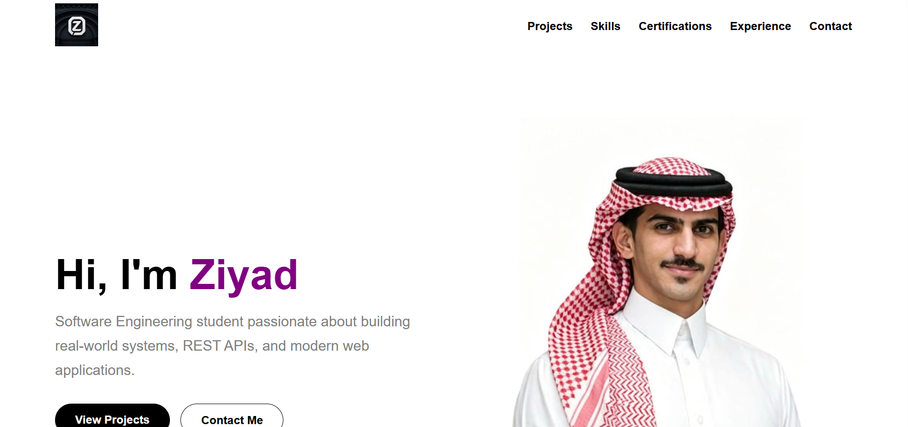

# 🚀 Personal Portfolio Website

🔗 Live Website  
https://ziyad-web.page.gd

## 📸 Preview

## 📌 About the Project
This project is a personal portfolio website developed using PHP and MySQL with a clean, responsive, and user-friendly design.
The website dynamically retrieves and displays information from a MySQL database, including personal details, skills, projects, and contact information. It was designed to provide an organized way to showcase work, achievements, and technical skills in a professional format.

## ✨ Features
- Responsive design for desktop and mobile devices
- Dynamic content loading using PHP and MySQL
- Navigation bar for smooth navigation
- Home / Welcome section
- About Me section
- Skills section
- Projects section
- Contact Form
- Contact messages stored directly in database
- CV PDF view/download support
- External links integration

## 🛠 Technologies Used
- PHP
- MySQL
- HTML
- CSS
- JavaScript
- XAMPP

## ⚡ Database
The database file is included in the project:

`cv_database.sql`

Import the SQL file into phpMyAdmin before running the project locally.

## 🌐 Live Demo
https://ziyad-web.page.gd

## 🎯 Project Goal
The goal of this project is to create a professional and responsive portfolio website that demonstrates practical skills in web development, database integration, and dynamic content management using PHP and MySQL.

---
Developed by Ziyad Alghadhban  
Software Engineering Student
